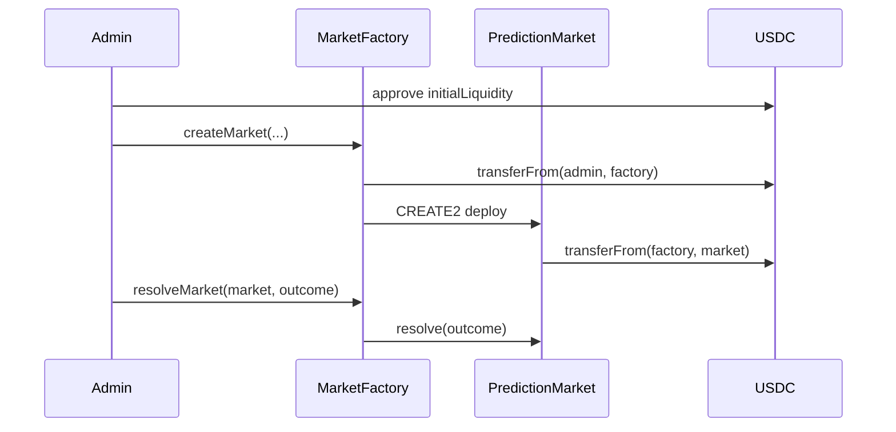
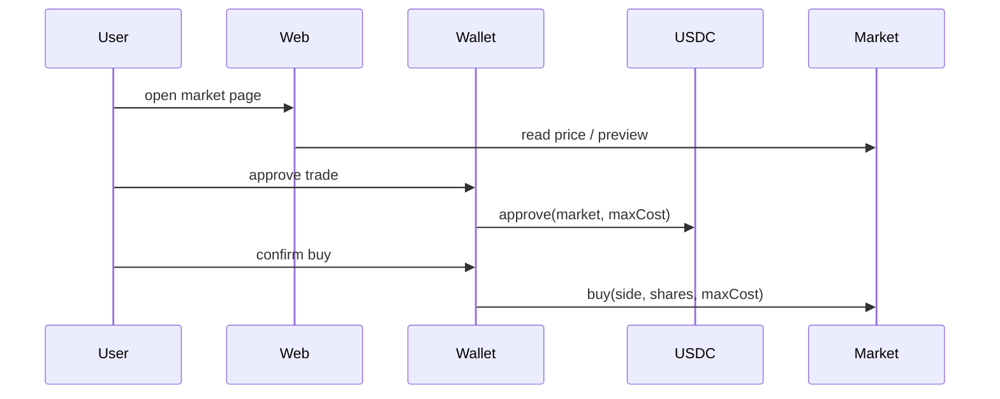
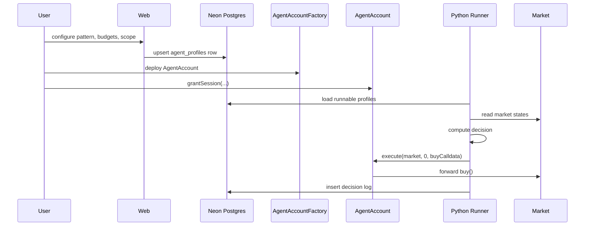

# YOLO Markets Architecture

## Purpose

YOLO Markets is a prediction-market platform on Arc testnet with three implemented cores:

1. On-chain binary LMSR markets settled in USDC.
2. A Next.js web app for discovery, trading, admin, and agent setup.
3. A Python autonomous trading runner that reads profiles from Postgres and can execute trades through per-user smart accounts.

The repo also contains a planned `api/` service, but that service is not implemented yet. The `api/` directory is currently empty.

## Current System Shape

The live architecture is simpler than the original plan documents imply:

- The web app talks directly to chain RPC and directly to Postgres-backed Next API routes.
- The Python agent talks directly to Arc RPC, Polymarket, OpenRouter, and Postgres.
- There is no separate Node gateway in use today.
- There is no FastAPI app exposed in the current `agent/` directory; the agent is a CLI runner plus shared DB/profile modules.

## High-Level Topology

```mermaid
flowchart TD
    U[User Wallet / Browser] --> W[Next.js Web App]
    W --> NAPI[Next API Routes]
    W --> ARC[Arc Testnet RPC]
    W --> PM[Polymarket Gamma API]
    NAPI --> PG[(Neon Postgres)]

    A[Python Agent Runner] --> ARC
    A --> PM
    A --> OR[OpenRouter / Claude]
    A --> PG

    ARC --> MF[MarketFactory]
    ARC --> PMKT[PredictionMarket[]]
    ARC --> AAF[AgentAccountFactory]
    ARC --> AA[AgentAccount[]]
```

## Repository Modules

### Root

- `contracts/`: Foundry Solidity project.
- `web/`: Next.js App Router frontend and server routes.
- `agent/`: Python runner and DB/profile access.
- `api/`: intended Node gateway, currently empty.
- `docker-compose.yml`: local Postgres only, optional in production.
- `.env`: shared environment source of truth across web and agent in local development.

## Contract Layer

The smart-contract layer defines two subsystems: market contracts and agent-account contracts.

### 1. Prediction Markets

Implemented in:

- `contracts/src/PredictionMarket.sol`
- `contracts/src/MarketFactory.sol`

#### PredictionMarket

`PredictionMarket` is a binary LMSR AMM with these properties:

- Settlement asset is Arc USDC ERC-20, using 6 decimals.
- Winning share redeems for exactly 1 USDC after resolution.
- Pricing is LMSR-based using PRBMath fixed-point math.
- Users can `buy`, `sell`, and `claim`.
- Market admin can `resolve` after deadline.
- State tracks per-user YES/NO shares and aggregate supply.

Core state:

- immutable `usdc`
- immutable `admin`
- immutable `deadline`
- immutable `initialLiquidity`
- immutable LMSR liquidity parameter `b`
- `question`, `category`, `resolutionCriteria`
- `qYes`, `qNo` as LMSR quantities
- `resolved`, `outcome`
- `sharesYes`, `sharesNo`

Core behavior:

- `buy(outcome, shares, maxCost)` computes exact LMSR cost and enforces slippage.
- `sell(outcome, shares, minReceived)` computes exact proceeds and enforces slippage.
- `resolve(outcome)` is admin-only and time-gated.
- `claim()` redeems winning shares after resolution.
- `previewBuy` and `previewSell` support frontend and agent estimation.

#### MarketFactory

`MarketFactory` is the admin and deployer for all markets.

Responsibilities:

- Pull seed USDC from admin.
- Deploy `PredictionMarket` instances via CREATE2.
- Keep canonical registry of all markets.
- Resolve markets centrally.
- Predict future market addresses before deployment.

This means market ownership is centralized at the factory layer, not at individual market EOAs.

### 2. Agent Smart Accounts

Implemented in:

- `contracts/src/AgentAccount.sol`
- `contracts/src/AgentAccountFactory.sol`

#### AgentAccount

`AgentAccount` is a per-user smart account that holds USDC and permits controlled execution.

Authorization model:

- `owner` can execute arbitrary calls and withdraw funds.
- Session keys can call `execute` only within scoped permissions.

Session permissions include:

- expiry (`validUntil`)
- total spend cap (`totalCap`)
- running spend meter (`totalSpent`)
- per-call spend cap (`perCallCap`)
- allowed target address
- allowed function selector

Special logic:

- For `buy(uint8,uint256,uint256)`, the account decodes `maxCost` from calldata and meters the session against worst-case USDC spend.
- Before forwarding `buy(...)`, the account auto-approves USDC to the target market for that exact `maxCost`.

This reduces the runner's required permission surface because it does not need broad ERC-20 `approve` rights.

#### AgentAccountFactory

`AgentAccountFactory` deploys one deterministic CREATE2 account per owner address.

Responsibilities:

- deterministic address prediction
- permissionless deployment
- owner to account registry
- common immutable USDC wiring for all deployed accounts

## Web Layer

The web app lives in `web/` and is a Next.js App Router application.

### Responsibilities

The web app currently handles:

- homepage market discovery
- native Arc market detail pages
- Polymarket catalog detail pages
- wallet-driven trading UI
- portfolio UI
- agent setup/settings UI
- admin login and admin workflows
- server-side Next API routes for profile persistence and admin auth

### Rendering Model

The web layer mixes server and client responsibilities:

- Server components aggregate market data and Polymarket catalog data.
- Client components handle wallet connection, contract writes, and interactive forms.
- Next API routes persist and fetch agent/admin data.

### Main Internal Subsystems

#### 1. Chain Read Layer

Implemented in `web/lib/markets.ts` and `web/lib/contracts.ts`.

Responsibilities:

- create a public viem client for Arc testnet
- read `MarketFactory.allMarkets()`
- multicall each market for summary state
- fetch detailed market data including `resolutionCriteria`
- expose deployed contract addresses and ABIs to client/server code

This is the web app's direct on-chain read model. No backend gateway is involved.

#### 2. Polymarket Catalog Layer

Implemented primarily in `web/lib/polymarket.ts`.

Responsibilities:

- fetch active Polymarket Gamma events server-side
- normalize event/market payloads into binary market cards
- classify categories
- expose slugs, images, liquidity, price, and 24h delta

Additional enrichment:

- `web/lib/native-image-overlay.ts` maps native Arc markets back to Polymarket images.
- `web/lib/native-movers.ts` ranks Arc-tradeable markets by Polymarket 24h movement.

This creates a hybrid catalog where wrapped/native Arc markets and Polymarket reference markets can coexist in one UI.

#### 3. Trading UI Layer

Main client trading flow is implemented in components such as `web/components/bet-ticket.tsx`.

Responsibilities:

- connect injected wallet via wagmi
- ensure correct chain (Arc testnet)
- read live price and preview buy cost
- read current USDC allowance
- prompt approval if needed
- submit `buy` transaction to the market contract
- wait for receipt and refresh local state

This is fully wallet-side execution from the browser.

#### 4. Agent Configuration API

The main profile API is `web/app/api/agent/profile/route.ts`.

Responsibilities:

- validate wallet address and profile payloads
- resolve pattern presets into concrete risk knobs
- store profile rows in Postgres
- fetch and delete profiles

Current trust model:

- profile mutation is not yet signature-gated
- comments in code mark this as a Phase-1 limitation
- the route assumes client identity is cooperative

#### 5. Admin Auth

Admin auth is implemented in:

- `web/lib/admin-auth.ts`
- `web/lib/admin-session.ts`
- `web/proxy.ts`
- admin API routes under `web/app/api/admin/*`

Auth model:

- EIP-191 signed message login
- challenge cookie for nonce/issued-at
- signed JWT session cookie after verification
- proxy performs only optimistic cookie presence check
- protected pages re-verify session server-side

This gives admin access without an on-chain login transaction.

## Agent Layer

The agent lives in `agent/` and is currently a Python runner, not a web service.

### Implemented Components

- `agent/loop.py`: main orchestrator
- `agent/profiles.py`: profile reader from Postgres
- `agent/db.py`: psycopg pool and insert/query helpers
- `agent/estimate.py`: model-related support
- `agent/decisions.jsonl`: legacy fallback log file

### Actual Runtime Model

The current agent is a command-line process invoked with `uv run python loop.py ...`.

It supports two execution modes:

- legacy mode: trades from a deployer EOA directly
- per-user mode: reads runnable user profiles and trades through `AgentAccount.execute(...)`

### Agent Pipeline

For each eligible market, the runner:

1. Reads on-chain market state from Arc RPC.
2. Optionally matches the market to Polymarket via fuzzy matching.
3. Optionally asks OpenRouter/Claude for a probability estimate.
4. Computes edge and Kelly sizing.
5. Applies profile-level caps and confidence thresholds.
6. Either records a pass decision or executes a buy.
7. Persists the decision to Postgres, falling back to JSONL if DB writes fail.

### Inputs to the Agent

The runner consumes:

- Arc RPC (`ARC_TESTNET_RPC_URL`)
- Polymarket Gamma (`POLYMARKET_GAMMA_URL`)
- OpenRouter (`OPENROUTER_API_KEY`, model config)
- Postgres (`DATABASE_URL`)
- on-chain session key (`AGENT_SESSION_PRIVATE_KEY`)
- profile rows from `agent_profiles`

### Profile-Driven Scheduling

The agent reads profiles from the shared Postgres table and filters them by:

- `active`
- presence of deployed `agent_address`
- presence of `session_key_address`
- non-expired `session_valid_until`

The watch scheduler is in-process and lightweight:

- no Redis
- no external queue
- cadence is tracked in memory today, with DB support prepared via `agent_session_keys.last_run_at`

## Persistence Layer

The data store is Postgres, intended for cloud use such as Neon.

### Schema Ownership

Source of truth is:

- `web/lib/db/schema.ts`

Migrations live in:

- `web/lib/db/migrations/`

TypeScript access path:

- Drizzle ORM + `postgres-js`

Python access path:

- `psycopg` + `psycopg_pool`

### Main Tables

#### `agent_profiles`

Stores user agent configuration:

- profile/pattern knobs
- market selection mode
- budget caps
- deployed `agent_address`
- session key metadata
- active/paused state

#### `agent_decisions`

Append-only decision log:

- market context
- market and AI probabilities
- action taken
- sizing
- tx hash
- reasoning and watch items
- user and agent identity

#### `agent_session_keys`

Prepared for next-tier productionization:

- encrypted per-user private keys
- public session address
- IV/auth tag metadata
- scheduling field `last_run_at`

This table is present in schema but is not the primary execution mechanism yet.

## External Dependencies

### Arc Testnet

Used for:

- market deployment
- market reads and writes
- agent-account deployment and execution
- USDC settlement and gas

Notable Arc-specific constraint:

- native gas is USDC with 18 decimals, while ERC-20 USDC operations use 6 decimals

### Polymarket Gamma

Used for:

- catalog discovery
- market imagery
- crowd-prior price signal
- 24h mover calculations

Implementation split:

- web uses server-side `fetch`
- agent uses `curl_cffi` because Python TLS fingerprinting against Gamma was problematic

### OpenRouter / Claude

Used for:

- AI probability estimation in both web and agent flows

The web estimate path is server-side and optional.
The agent estimate path is part of the trading decision pipeline.

### Neon / Cloud Postgres

Used for:

- agent profile storage
- decision log storage
- future session-key storage
- shared persistence between web and agent

### Docker Compose

`docker-compose.yml` exists only for optional local Postgres.
Production architecture does not require Docker and can run entirely against Neon.

## Implemented End-to-End Flows

### 1. Market Creation and Resolution



### 2. Browser Trading



### 3. Agent Setup and Autonomous Execution



## Runtime Configuration Model

Shared configuration is primarily in root `.env`.

Important categories:

- Arc RPC and chain parameters
- deployer/admin keys
- agent session key
- admin auth secrets
- OpenRouter settings
- `DATABASE_URL` for Neon

Web-specific local overrides may live in `web/.env.local`, but the project now supports loading root `.env` as a dev fallback for DB configuration.

## Intended vs Actual Architecture

### Intended in docs / comments

- separate Node API gateway in `api/`
- Python FastAPI service for agent
- broader service separation

### Actual in repo

- no Node gateway implementation
- no FastAPI app implementation
- Next API routes serve application backend duties
- Python agent is an offline/daemon runner
- web and agent both access Neon directly

This means the current architecture is a dual-backend system, not a three-service system.

## Gaps and Risks

### Implemented but incomplete

- profile writes are not yet wallet-signature-gated
- agent scheduler is in-process and not distributed
- per-user session-key encryption flow is schema-ready but not fully productized

### Missing modules

- `api/` service is empty
- no separately deployed agent HTTP service exists in this repo

### Operational constraints

- agent session key must hold native-gas USDC on Arc
- Polymarket event payloads are large; server caching can exceed Next cache item limits
- Arc-specific Foundry simulation around USDC is unreliable for transfer-touching scripts

## Recommended Mental Model

Think of the project as five layers:

1. Arc contracts define market and agent-account primitives.
2. Next.js is both the frontend and part of the backend.
3. Neon is the shared persistence plane between web and agent.
4. Python runner is the autonomous execution engine.
5. Polymarket and OpenRouter are external intelligence and discovery dependencies.

That is the full implemented architecture today.
